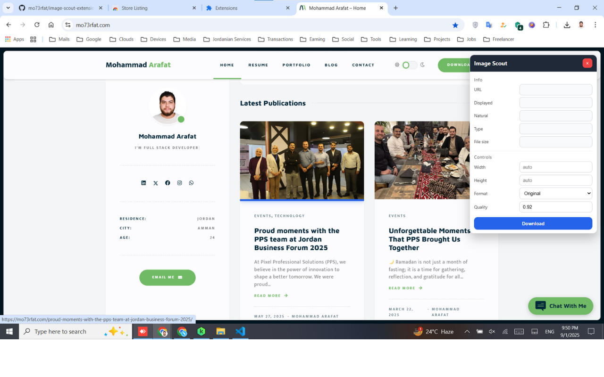
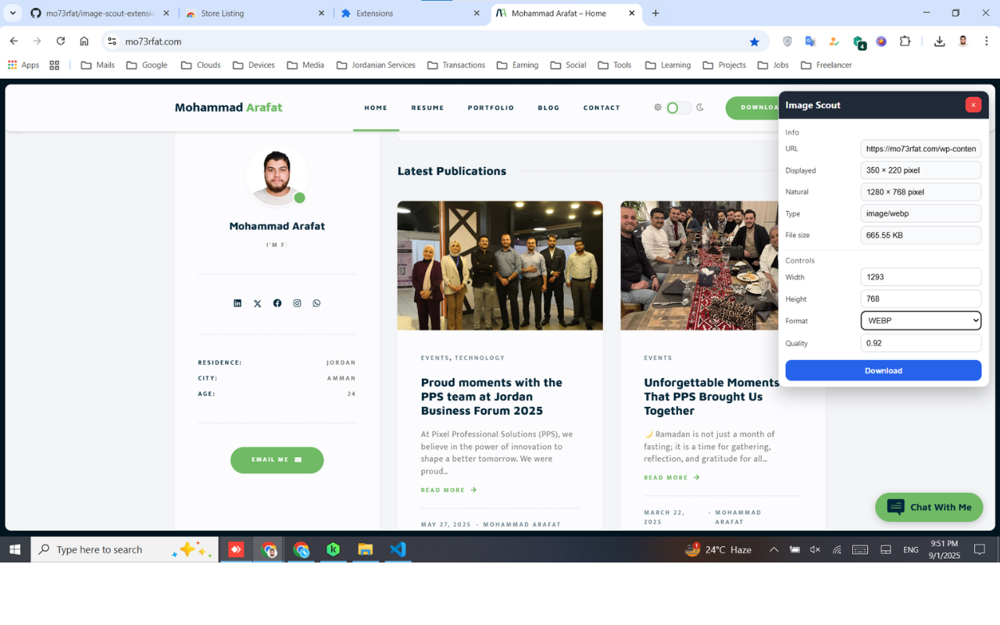
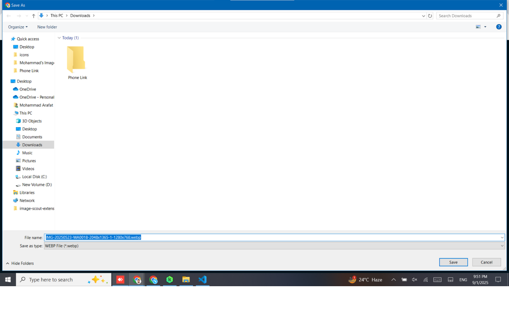

# Image Scout Extension

**Image Scout** is a Chrome extension that lets you click any image on the web and instantly see its **dimensions, file size, type**, and download it in the **format and quality you choose**.  

Built with **Manifest V3**, lightweight and easy to use.

|  |  |  |  |
|-----------------------------|-----------------------------|-----------------------------|-----------------------------|

---

## 🚀 Features

- Click any image on a webpage to inspect it.  
- Displays:
  - Selected image URL  
  - Displayed size (W × H pixel)  
  - Natural/original size (W × H pixel)  
  - File type (JPEG, PNG, WebP, etc.)  
  - File size (in KB/MB)  
- Change **width, height, format, and quality** before downloading.  
- Download the image in:
  - Original format & dimensions  
  - Converted format (JPEG, PNG, WebP) with adjustable quality  
- Smooth highlight animation when image is selected.  
- Easy close button to stop the extension completely.

---

## 📥 Installation

You can install the extension directly from the Chrome Web Store:  

👉 [Image Scout on Chrome Web Store](https://chromewebstore.google.com/)

---

## 🛠 Usage

1. Click the extension icon.  
2. Hover over any image — it will be highlighted.  
3. Click the image to select it.  
4. The info panel appears with all details and controls.  
5. Adjust format/quality/size if needed.  
6. Click **Download** to save the image.  
7. Use the **× button** to close and stop the extension.

---